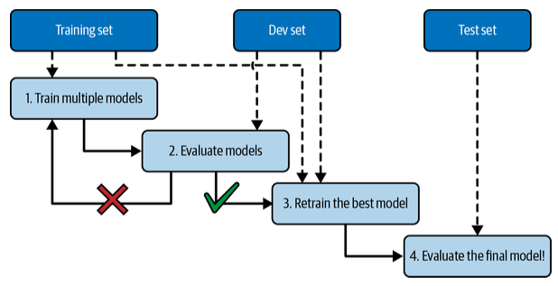

# Chapter 1. The Machine Learning Landscape <!-- omit in toc -->

- [What Is Machine Learning?](#what-is-machine-learning)
- [Why Use Machine Learning?](#why-use-machine-learning)
- [Types of Machine Learning Systems](#types-of-machine-learning-systems)
  - [Training Supervision](#training-supervision)
    - [Supervised learning](#supervised-learning)
    - [Unsupervised learning](#unsupervised-learning)
    - [Semi-supervised learning](#semi-supervised-learning)
    - [Self-supervised learning](#self-supervised-learning)
    - [Reinforcement learning](#reinforcement-learning)
  - [Batch vs Online Learning](#batch-vs-online-learning)
    - [Batch learning](#batch-learning)
    - [Online learning](#online-learning)
  - [Instance-Based Versus Model-Based Learning](#instance-based-versus-model-based-learning)
    - [Instance-based learning](#instance-based-learning)
    - [Model-based learning and a typical machine learning workflow](#model-based-learning-and-a-typical-machine-learning-workflow)
- [Main challenges of Machine Learning](#main-challenges-of-machine-learning)
  - [Insufficient Quantity of Training Data](#insufficient-quantity-of-training-data)
  - [Nonrepresentative Training Data](#nonrepresentative-training-data)
  - [Poor-Quality Data](#poor-quality-data)
  - [Irrelevant Features](#irrelevant-features)
  - [Overfitting the Training Data](#overfitting-the-training-data)
  - [Underfitting the Training Data](#underfitting-the-training-data)
- [Testing and Validating](#testing-and-validating)
  - [Hyperparameter Tuning and Model Selection](#hyperparameter-tuning-and-model-selection)
  - [Data Mismatch](#data-mismatch)
- [Exercises](#exercises)

## What Is Machine Learning?

> Machine Learning is the science (and art) of programming computers so they can learn from data. - Arthur Samuel, 1959

## Why Use Machine Learning?

Machine Learning can help humans learn. Sometimes when you train a model and inspect the solution, it may help you to understand the problem in question and get an even better model.

To summarize, machine learning is great for:

- Problems for which existing solutions require a lot of fine-tuning or long lists of rules (a machine learning model can often simplify code and perform better than the traditional approach)
- Complex problems for which using a traditional approach yields no good solution (the best machine learning techniques can perhaps find a solution)
- Fluctuating environments (a machine learning system can easily be retrained on new data, always keeping it up to date)
- Getting insights about complex problems and large amounts of data

## Types of Machine Learning Systems

There are many types of machine learning systems classified based in the following criteria:

- How they are supervised while being trained.
- Whether they can or cannot learn in the fly.
- Whether they work by simply comparing new data points to known data points, or instead by detecting patterns in the training data and building a predictive model, much like scientists do.

### Training Supervision

There are 5 main types of supervision in training: supervised learning, unsupervised learning, self-supervised learning, semi-supervised learning, and reinforcement learning.

#### Supervised learning

In supervised learning you tell the algorithm what data you are working with, it is called _labels_. For example, if you are training it to detect between cats and dogs, you mark the images (training data) with _labels_ saying if it's a cat or a dog.

#### Unsupervised learning

The data you're working with it's not labeled. For example, if you make an algorith to detect the visitors of a blog, the model starts grouping the visitors because of some connections it made.

#### Semi-supervised learning

It's when you have data both labeled and not labeled. For example in Google Photos, it groups faces (no labeling) but then you say who is it everyone in the picture (labeling).

#### Self-supervised learning

It involves creating a fully labeled dataset from a fully unlabeled one, so that it can be used by any supervised learning algorithm.

#### Reinforcement learning

The agent (model) performs actions and then, based on a reward system learns what can he do and what not. For example in my [reinforcement learning project](https://github.com/msosav/zelda-reinforcement-learning) where an agent plays The Legend of Zelda: Link's Awakening.

### Batch vs Online Learning

Another criterion used to classify machine learning systems is whether or not the system can learn incrementally from a stream of incoming data.

#### Batch learning

In _batch learning_, the system is incapable of learning incrementally: it must be trained using all the available data. This will generally take a lot of time and computing resources, so it is typically done offline. First the system is trained, and then it is launched into production and runs without learning anymore; it just applies what it has learned. This is called offline learning.

So, if you want the model to work with new data, you need to train it again with the old and new data and deploy it to production (again).

#### Online learning

In online learning, you train the system incrementally by feeding it data instances sequentially, either individually or in small groups called mini-batches. Each learning step is fast and cheap, so the system can learn about new data on the fly, as it arrives.

One important parameter of online learning systems is how fast they should adapt to changing data: this is called the learning rate. If you set a high learning rate, then your system will rapidly adapt to new data, but it will also tend to quickly forget the old data.

### Instance-Based Versus Model-Based Learning

There are two main approaches to generalization: instance-based learning and model-based learning.

#### Instance-based learning

The system learns the examples by heart, then generalizes to new cases by using a similarity measure to compare them to the learned examples (or a subset of them)

#### Model-based learning and a typical machine learning workflow

Another way to generalize from a set of examples is to build a model of these examples and then use that model to make predictions. This is called model-based learning.

## Main challenges of Machine Learning

### Insufficient Quantity of Training Data

For a model to generalize well, it needs to be trained on a lot of data. As a rule of thumb, the more data, the better the model will perform.

### Nonrepresentative Training Data

In order to generalize well, it is crucial that your training data be representative of the new cases you want to generalize to. This is true whether you are using instance-based or model-based learning. For example, say you want to build a system to recognize funk music videos. One way to build your training set is to search for “funk music” on YouTube and use the resulting videos. But this assumes that YouTube’s search engine returns a set of videos that are representative of all the funk music videos on YouTube. In reality, the search results are likely to be biased toward popular artists (and if you live in Brazil you will get a lot of “funk carioca” videos, which sound nothing like James Brown).

### Poor-Quality Data

If your training data is full of errors, outliers, and noise (as it often is), it will make it harder for the system to detect the underlying patterns, so your system is less likely to perform well. It is often well worth the effort to spend time cleaning up your training data. The truth is, most data scientists spend a significant part of their time doing just that.

### Irrelevant Features

Your system will only be capable of learning if the training data contains enough relevant features and not too many irrelevant ones. A critical part of the success of a Machine Learning project is coming up with a good set of features to train on. This process, called _feature engineering_.

### Overfitting the Training Data

Overgeneralizing is something that we humans do all too often, and unfortunately machines can fall into the same trap if we are not careful. In machine learning this is called overfitting: it means that the model performs well on the training data, but it does not generalize well.

Overfitting happens when the model is too complex relative to the amount and noisiness of the training data. Here are possible solutions:

- Simplify the model by selecting one with fewer parameters (e.g., a linear model rather than a high-degree polynomial model), by reducing the number of attributes in the training data, or by constraining the model.

- Gather more training data.

- Reduce the noise in the training data (e.g., fix data errors and remove outliers).

### Underfitting the Training Data

it occurs when your model is too simple to learn the underlying structure of the data. For example, a linear model of life satisfaction is prone to underfit; reality is just more complex than the model, so its predictions are bound to be inaccurate, even on the training examples.

Here are the main options for fixing this problem:

- Select a more powerful model, with more parameters.

- Feed better features to the learning algorithm (feature engineering).

- Reduce the constraints on the model (for example by reducing the regularization hyperparameter).

## Testing and Validating

You should split your data into two sets: the training set and the test set. As these names imply, you train your model using the training set, and you test it using the test set. The error rate on new cases is called the generalization error (or out-of-sample error), and by evaluating your model on the test set, you get an estimation of this error. This value tells you how well your model will perform on instances it has never seen before.

> [!IMPORTANT]
> If the training error is low (i.e., your model makes few mistakes on the training set) but the generalization error is high, it means that your model is overfitting the training data.

> [!TIP]
> It is common to use 80% of the data for training and hold out 20% for testing. However, this depends on the size of the dataset: if it contains 10 million instances, then holding out 1% means your test set will contain 100,000 instances, probably more than enough to get a good estimate of the generalization error.

### Hyperparameter Tuning and Model Selection

_Holdout validation_ is when you hold out part of the training set to evaluate several candidate models and select the best one. The new held-out set is called the _validation set_. More specifically, you train multiple models with various hyperparameters on the reduced training set (i.e., the full training set minus the validation set), and you select the model that performs best on the validation set. After this holdout validation process, you train the best model on the full training set (including the validation set), and this gives you the final model. Lastly, you evaluate this final model on the test set to get an estimate of the generalization error.

### Data Mismatch

In some cases, it’s easy to get a large amount of data for training, but this data probably won’t be perfectly representative of the data that will be used in production. For example, suppose you want to create a mobile app to take pictures of flowers and automatically determine their species. You can easily download millions of pictures of flowers on the web, but they won’t be perfectly representative of the pictures that will actually be taken using the app on a mobile device. Perhaps you only have 1,000 representative pictures (i.e., actually taken with the app).

## Exercises

1. How would you define machine learning?

Machine Learning is about building systems that can learn from data. Learning means getting better at some task, given some performance measure.

2. Can you name four types of applications where it shines?

Machine Learning is great for:

- Complex problems for which we have no algorithmic solution
- Replacing long lists of hand-tuned rules
- Building systems that adapt to fluctuating environments
- Helping humans learn (e.g., data mining)

3. What is a labeled training set?

A labeled training set is a training set that contains the desired solution (a.k.a. a label) for each instance.

4. What are the two most common supervised tasks?

The two most common supervised tasks are regression and classification.

5. Can you name four common unsupervised tasks?

Common unsupervised tasks include:

- Clustering
- Visualization
- Dimensionality reduction
- Association rule learning

6. What type of algorithm would you use to allow a robot to walk in various unknown terrains?

Reinforcement Learning is likely to perform best if we want a robot to learn to walk in various unknown terrains, since this is typically the type of problem that Reinforcement Learning tackles. It might be possible to express the problem as a supervised or semisupervised learning problem, but it would be less natural.

7. What type of algorithm would you use to segment your customers into multiple groups?

If you don't know how to define the groups, then you can use a clustering algorithm (unsupervised learning) to segment your customers into clusters of similar customers. However, if you know what groups you would like to have, then you can feed many examples of each group to a classification algorithm (supervised learning), and it will classify all your customers into these groups.

8. Would you frame the problem of spam detection as a supervised learning problem or an unsupervised learning problem?

Spam detection is a typical supervised learning problem: the algorithm is fed many emails along with their label (spam or not spam).

9. What is an online learning system?

An online learning system can learn incrementally, as opposed to batch learning. This makes it capable of adapting rapidly to both changing data and autonomous systems, and of training on very large quantities of data.

10. What is out-of-core learning?

Out-of-core algorithms can handle vast quantities of data that cannot fit in a computer's main memory. An out-of-core learning algorithm chops the data into mini-batches and uses online learning techniques to learn from these mini-batches.

11. What type of algorithm relies on a similarity measure to make predictions?

An instance-based learning system learns the training data by heart; then, when given a new instance, it uses a similarity measure to find the most similar learned instances and uses them to make predictions.

12. What is the difference between a model parameter and a model hyperparameter?

A model has one or more model parameters that determine what it will predict given a new instance (e.g., the slope of a linear model). A learning algorithm tries to find optimal values for these parameters such that the model generalizes well to new instances. A hyperparameter is a parameter of the learning algorithm itself, not of the model (e.g., the amount of regularization to apply).

13. What do model-based algorithms search for? What is the most common strategy they use to succeed? How do they make predictions?

Model-based learning algorithms search for an optimal value for the model parameters such that the model will generalize well to new instances. We usually train such systems by minimizing a cost function that measures how bad the system is at making predictions on the training data, plus a penalty for model complexity if the model is regularized. To make predictions, we feed the new instance's features into the model's prediction function, using the parameter values found by the learning algorithm.

14. Can you name four of the main challenges in machine learning?

Some of the main challenges in Machine Learning are:

- Lack of data
- Poor data quality
- Nonrepresentative data
- Uninformative features
- Excessively simple models that underfit the training data
- Excessively complex models that overfit the data

15. If your model performs great on the training data but generalizes poorly to new instances, what is happening? Can you name three possible solutions?

If a model performs great on the training data but generalizes poorly to new instances, the model is likely overfitting the training data (or we got extremely lucky on the training data).

Possible solutions to overfitting are:

1. Getting more data
2. Simplifying the model (selecting a simpler algorithm, reducing the number of parameters or features used, or regularizing the model)
3. Reducing the noise in the training data

16. What is a test set, and why would you want to use it?

A test set is used to estimate the generalization error that a model will make on new instances, before the model is launched in production.

17. What is the purpose of a validation set?

A validation set is used to compare models. It makes it possible to select the best model and tune the hyperparameters.

18. What is the train-dev set, when do you need it, and how do you use it?

The train-dev set is used when there is a risk of mismatch between the training data and the data used in the validation and test datasets (which should always be as close as possible to the data used once the model is in production).

The train-dev set is a part of the training set that's held out (the model is not trained on it). The model is trained on the rest of the training set, and evaluated on both the train-dev set and the validation set.

If the model performs well on the training set but not on the train-dev set, then the model is likely overfitting the training set. If it performs well on both the training set and the train-dev set, but not on the validation set, then there is probably a significant data mismatch between the training data and the validation + test data, and you should try to improve the training data to make it look more like the validation + test data.

19. What can go wrong if you tune hyperparameters using the test set?

If you tune hyperparameters using the test set, you risk overfitting the test set, and the generalization error you measure will be optimistic (you may launch a model that performs worse than you expect).

